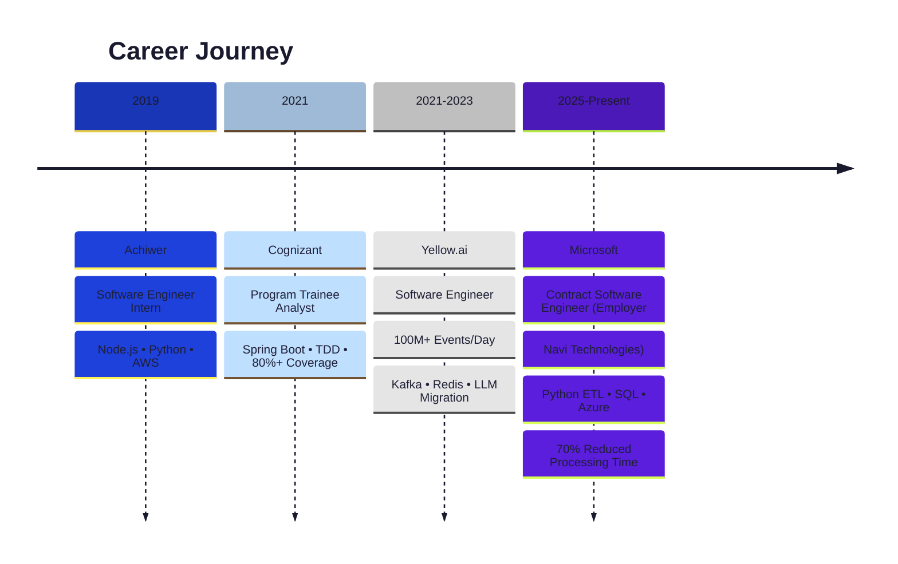

<!-- Gradient Header -->
<div align="center">
  
</div>

<!-- Animated Tagline -->
<p align="center">
  <a href="https://git.io/typing-svg">
    
  </a>
</p>

<!-- Contact Links -->
<p align="center">
  <a href="https://linkedin.com/in/manish-reddyb/">
    
  </a>
  <a href="https://manishbotta.me">
    
  </a>
  <a href="mailto:mabotta12@gmail.com">
    
  </a>
  <a href="https://github.com/manishrdy">
    
  </a>
</p>

---

## 👨‍💻 About

Backend Engineer with **3+ years** of experience building reliable backend systems. I specialize in building RESTful APIs, event-driven architectures, and AI-integrated backend pipelines. Currently exploring the intersection of traditional backend engineering and Generative AI.

```python
class ManishBotta:
    def __init__(self):
        self.location = "Los Angeles, CA"
        self.education = "M.S. Computer Science @ CSUSB (3.8 GPA)"
        self.languages = ["Python", "Node.js", "Java", "JavaScript"]
        self.interests = ["System Design", "Backend Architecture", "LLM Pipelines"]
        
    def current_focus(self):
        return [
            "Scalable Backend Development",
            "RAG pipelines & LLM integrations",
            "High-performance caching strategies"
        ]
```

---

## 🛠️ Tech Stack

<table>
  <tr>
    <td align="center" width="110">
      
      <br>Python
    </td>
    <td align="center" width="110">
      
      <br>Node.js
    </td>
    <td align="center" width="110">
      
      <br>Java
    </td>
    <td align="center" width="110">
      
      <br>JavaScript
    </td>
    <td align="center" width="110">
      
      <br>Go
    </td>
  </tr>
  <tr>
    <td align="center" width="110">
      
      <br>FastAPI
    </td>
    <td align="center" width="110">
      
      <br>Flask
    </td>
    <td align="center" width="110">
      
      <br>Express.js
    </td>
    <td align="center" width="110">
      
      <br>Django
    </td>
    <td align="center" width="110">
      
      <br>Spring Boot
    </td>
  </tr>
  <tr>
    <td align="center" width="110">
      
      <br>PostgreSQL
    </td>
    <td align="center" width="110">
      
      <br>MongoDB
    </td>
    <td align="center" width="110">
      
      <br>Redis
    </td>
    <td align="center" width="110">
      
      <br>Kafka
    </td>
    <td align="center" width="110">
      
      <br>MySQL
    </td>
  </tr>
  <tr>
    <td align="center" width="110">
      
      <br>AWS
    </td>
    <td align="center" width="110">
      
      <br>Docker
    </td>
    <td align="center" width="110">
      
      <br>CI/CD
    </td>
    <td align="center" width="110">
      
      <br>Linux
    </td>
  </tr>
</table>

**AI/ML Stack:** LangChain • RAG Pipelines • Fine-Tuning (QLoRA/LoRA) • Vector DBs (FAISS, Chroma) • OpenAI • HuggingFace

---


---

## 💼 Experience


```mermaid
%%{init: {'theme': 'base', 'themeVariables': { 'primaryColor': '#667eea', 'primaryTextColor': '#1a1a2e', 'primaryBorderColor': '#764ba2', 'lineColor': '#667eea', 'secondaryColor': '#f8fafc', 'tertiaryColor': '#ffffff'}}}%%
timeline
    title Career Journey
    
    2019 : Achiwer
         : Software Engineer Intern
         : Node.js • Python • AWS
    
    2021 : Cognizant
         : Program Trainee Analyst
         : Spring Boot • TDD • 80%+ Coverage
    
    2021-2023 : Yellow.ai
               : Software Engineer
               : 100M+ Events/Day
               : Kafka • Redis • LLM Migration
    
    2025-Present : Microsoft
                 : Contract Software Engineer (Employer: Navi Technologies)
                 : Python ETL • SQL • Azure
                 : 70% Reduced Processing Time
```

| Company | Role | Highlights |
|---------|------|------------|
| **Microsoft** (via Navi Technologies) | Contract Software Engineer | Python ETL pipelines, 60% improved data availability, 70% reduced processing time, Azure CI/CD |
| **Yellow.ai** | Software Engineer | Scaled to 100M+ events/day, 40% latency reduction, LLM pipeline migration |
| **Cognizant** | Program Trainee | Spring Boot APIs, 80%+ test coverage, microservices migration |
| **Achiwer** | Intern | Learning platform backend, 1000+ users, AWS deployment |

---

## 🚀 Featured Projects

<table>
<tr>
<td width="50%">

### 🎙️ Async Audio Pipeline
**Multi-stage NLP processing system**

- ⚡ **3× throughput** improvement
- 📉 **80% reduction** in review time  
- 🔄 Queue-driven fault-tolerant processing

`FastAPI` `Redis` `LLMs` `Docker`

[](https://github.com/Manishrdy/async-audio-pipeline)

</td>
<td width="50%">

### 📄 AI Resume Tailoring
**RAG-powered resume optimization**

- 🎯 **45% better** retrieval accuracy
- 💾 **60% less** GPU memory usage
- 🤖 Fine-tuned with QLoRA

`FastAPI` `FAISS` `LangChain` `Chroma`

[](https://github.com/Manishrdy/AI-Driven-Resume-Builder)

</td>
</tr>
<tr>
<td width="50%">

### 🏏 SimCricketX
**Real-time multi-user simulation engine**

- 🎮 Concurrent state management
- 📊 **50% fewer** hard-coded rules
- ☁️ Deployed on Oracle Cloud

`Flask` `Python` `Redis` `CI/CD`

[](https://github.com/Manishrdy/SimCricketX)

</td>
<td width="50%">

### 🔗 URL Shortener
**High-performance link service**

- 💾 **70% reduction** in DB reads
- ⚡ **60% faster** redirects
- 🔄 Smart cache invalidation

`Node.js` `MongoDB` `Redis` `Docker`

[](https://github.com/Manishrdy/url_shortener)

</td>
</tr>
</table>

---


## 📈 GitHub Stats

<div align="center">
  <picture>
    <source media="(prefers-color-scheme: dark)" srcset="https://github-readme-stats.vercel.app/api?username=manishrdy&show_icons=true&theme=github_dark&hide_border=true&count_private=true" />
    <source media="(prefers-color-scheme: light)" srcset="https://github-readme-stats.vercel.app/api?username=manishrdy&show_icons=true&theme=default&hide_border=true&count_private=true" />
    
  </picture>
  &nbsp;&nbsp;
  <picture>
    <source media="(prefers-color-scheme: dark)" srcset="https://github-readme-stats.vercel.app/api/top-langs/?username=manishrdy&layout=compact&theme=github_dark&hide_border=true&langs_count=6" />
    <source media="(prefers-color-scheme: light)" srcset="https://github-readme-stats.vercel.app/api/top-langs/?username=manishrdy&layout=compact&theme=default&hide_border=true&langs_count=6" />
    
  </picture>
</div>

<br/>

<div align="center">
  <picture>
    <source media="(prefers-color-scheme: dark)" srcset="https://streak-stats.demolab.com?user=manishrdy&theme=github-dark-blue&hide_border=true" />
    <source media="(prefers-color-scheme: light)" srcset="https://streak-stats.demolab.com?user=manishrdy&theme=default&hide_border=true" />
    
  </picture>
</div>

<br/>


<br/>


<br/>

<!-- Additional Metrics -->
<div align="center">
  
</div>

<br/>

<div align="center">
  
  
  
</div>

---

## 🎓 Education

| Degree | University | GPA | Timeline |
|--------|-----------|-----|----------|
| **M.S. Computer Science** | California State University, San Bernardino | 3.8/4.0 | 2023 - 2025 |
| **B.Tech Computer Science** | Amrita Vishwa Vidyapeetham, India | 3.1/4.0 | 2017 - 2021 |

**Relevant Coursework:** Algorithms • AI/ML • Software Engineering • Operating Systems

---

## 📬 Let's Connect

<p align="center">
  <a href="https://linkedin.com/in/manish-reddyb/">
    
  </a>
  <a href="mailto:mabotta12@gmail.com">
    
  </a>
  <a href="https://manishbotta.me">
    
  </a>
</p>

<p align="center">
  
</p>

---

<p align="center">
  
</p>

<!-- Footer -->

```
