<!-- Gradient Header -->
<div align="center">
  
</div>

<!-- Animated Tagline -->
<p align="center">
  <a href="https://git.io/typing-svg">
    
  </a>
</p>

<!-- Contact Links -->
<p align="center">
  <a href="https://linkedin.com/in/manish-reddyb/">
    
  </a>
  <a href="https://manishbotta.me">
    
  </a>
  <a href="mailto:mabotta12@gmail.com">
    
  </a>
  <a href="https://github.com/manishrdy">
    
  </a>
</p>

---

## 👨‍💻 About

Backend Engineer with **3+ years** of experience designing scalable distributed systems. I specialize in building high-throughput microservices, event-driven architectures, and AI-integrated backend pipelines. Currently exploring the intersection of traditional backend engineering and Generative AI.

```python
class ManishBotta:
    def __init__(self):
        self.location = "Los Angeles, CA"
        self.education = "M.S. Computer Science @ CSUSB (3.8 GPA)"
        self.languages = ["Python", "Node.js", "Java", "TypeScript"]
        self.interests = ["System Design", "Distributed Systems", "LLM Pipelines"]
        
    def current_focus(self):
        return [
            "Event-driven microservices at scale",
            "RAG pipelines & LLM integrations",
            "High-performance caching strategies"
        ]
```

---

## 🛠️ Tech Stack

<table>
  <tr>
    <td align="center" width="110">
      
      <br>Python
    </td>
    <td align="center" width="110">
      
      <br>Node.js
    </td>
    <td align="center" width="110">
      
      <br>Java
    </td>
    <td align="center" width="110">
      
      <br>TypeScript
    </td>
    <td align="center" width="110">
      
      <br>Go
    </td>
  </tr>
  <tr>
    <td align="center" width="110">
      
      <br>FastAPI
    </td>
    <td align="center" width="110">
      
      <br>Flask
    </td>
    <td align="center" width="110">
      
      <br>Express.js
    </td>
    <td align="center" width="110">
      
      <br>Django
    </td>
    <td align="center" width="110">
      
      <br>Spring Boot
    </td>
  </tr>
  <tr>
    <td align="center" width="110">
      
      <br>PostgreSQL
    </td>
    <td align="center" width="110">
      
      <br>MongoDB
    </td>
    <td align="center" width="110">
      
      <br>Redis
    </td>
    <td align="center" width="110">
      
      <br>Kafka
    </td>
    <td align="center" width="110">
      
      <br>MySQL
    </td>
  </tr>
  <tr>
    <td align="center" width="110">
      
      <br>AWS
    </td>
    <td align="center" width="110">
      
      <br>Docker
    </td>
    <td align="center" width="110">
      
      <br>Kubernetes
    </td>
    <td align="center" width="110">
      
      <br>CI/CD
    </td>
    <td align="center" width="110">
      
      <br>Linux
    </td>
  </tr>
</table>

**AI/ML Stack:** LangChain • RAG Pipelines • Fine-Tuning (QLoRA/LoRA) • Vector DBs (FAISS, Chroma) • OpenAI • HuggingFace

---

## 📊 Impact Metrics

<table>
  <tr>
    <td align="center">
      
      <br/>
      <sub><b>Events/Day</b></sub>
      <br/>
      <sup>Distributed Systems</sup>
    </td>
    <td align="center">
      
      <br/>
      <sub><b>Uptime</b></sub>
      <br/>
      <sup>Production SLA</sup>
    </td>
    <td align="center">
      
      <br/>
      <sub><b>Latency Cut</b></sub>
      <br/>
      <sup>P95 Response</sup>
    </td>
    <td align="center">
      
      <br/>
      <sub><b>DB Reads Cut</b></sub>
      <br/>
      <sup>Redis Caching</sup>
    </td>
    <td align="center">
      
      <br/>
      <sub><b>Faster Releases</b></sub>
      <br/>
      <sup>CI/CD Pipeline</sup>
    </td>
  </tr>
</table>

<br/>

| Area | What I Built | Impact |
|:-----|:-------------|:-------|
| **Distributed Systems** | Event-driven microservices with Kafka & Redis | Scaled to 100M+ events/day |
| **API Performance** | Caching layers, rate limiting, query optimization | 40% latency reduction |
| **AI/ML Integration** | RAG pipelines, LLM fine-tuning, vector search | 60% model accuracy boost |
| **DevOps** | Containerized deployments, CI/CD automation | Zero-downtime releases |
| **Data Pipelines** | Async processing, queue-driven workflows | 3× throughput improvement |

---

## 💼 Experience


| Company | Role | Highlights |
|---------|------|------------|
| **Navi Technologies** | Software Engineer | OAuth 2.0 integrations, 70% reduction in manual data handling, zero-downtime CI/CD |
| **Yellow.ai** | Software Engineer | Scaled to 100M+ events/day, 40% latency reduction, LLM pipeline migration |
| **Cognizant** | Program Trainee | Spring Boot APIs, 80%+ test coverage, microservices migration |
| **Achiwer** | Intern | Learning platform backend, 1000+ users, AWS deployment |

---

## 🚀 Featured Projects

<table>
<tr>
<td width="50%">

### 🎙️ Async Audio Pipeline
**Multi-stage NLP processing system**

- ⚡ **3× throughput** improvement
- 📉 **80% reduction** in review time  
- 🔄 Queue-driven fault-tolerant processing

`FastAPI` `Redis` `LLMs` `Docker`

[](https://github.com/Manishrdy/async-audio-pipeline)

</td>
<td width="50%">

### 📄 AI Resume Tailoring
**RAG-powered resume optimization**

- 🎯 **45% better** retrieval accuracy
- 💾 **60% less** GPU memory usage
- 🤖 Fine-tuned with QLoRA

`FastAPI` `FAISS` `LangChain` `Chroma`

[](https://github.com/Manishrdy/AI-Driven-Resume-Builder)

</td>
</tr>
<tr>
<td width="50%">

### 🏏 SimCricketX
**Real-time multi-user simulation engine**

- 🎮 Concurrent state management
- 📊 **50% fewer** hard-coded rules
- ☁️ Deployed on Oracle Cloud

`Flask` `Python` `Redis` `CI/CD`

[](https://github.com/Manishrdy/SimCricketX)

</td>
<td width="50%">

### 🔗 URL Shortener
**High-performance link service**

- 💾 **70% reduction** in DB reads
- ⚡ **60% faster** redirects
- 🔄 Smart cache invalidation

`Node.js` `MongoDB` `Redis` `Docker`

[](https://github.com/Manishrdy/url_shortener)

</td>
</tr>
</table>

---

## 🏗️ System Design Philosophy

```mermaid
%%{init: {'theme': 'base', 'themeVariables': { 'primaryColor': '#667eea', 'primaryTextColor': '#1a1a2e', 'primaryBorderColor': '#667eea', 'lineColor': '#764ba2'}}}%%
flowchart LR
    A[📥 Request] --> B{Load Balancer}
    B --> C[API Gateway]
    C --> D[Auth Service]
    D --> E{Rate Limiter}
    E -->|✓| F[Microservices]
    E -->|✗| G[429 Throttled]
    F --> H[(Redis Cache)]
    F --> I[(PostgreSQL)]
    F --> J[Kafka Queue]
    J --> K[Async Workers]
    K --> L[📤 Response]
    
    style A fill:#22c55e,color:#fff,stroke:#16a34a
    style L fill:#22c55e,color:#fff,stroke:#16a34a
    style H fill:#dc2626,color:#fff,stroke:#b91c1c
    style I fill:#3b82f6,color:#fff,stroke:#2563eb
    style J fill:#1a1a2e,color:#fff,stroke:#374151
```



---

## 📈 GitHub Stats

<div align="center">
  <picture>
    <source media="(prefers-color-scheme: dark)" srcset="https://github-readme-stats.vercel.app/api?username=manishrdy&show_icons=true&theme=github_dark&hide_border=true&count_private=true" />
    <source media="(prefers-color-scheme: light)" srcset="https://github-readme-stats.vercel.app/api?username=manishrdy&show_icons=true&theme=default&hide_border=true&count_private=true" />
    
  </picture>
  &nbsp;&nbsp;
  <picture>
    <source media="(prefers-color-scheme: dark)" srcset="https://github-readme-stats.vercel.app/api/top-langs/?username=manishrdy&layout=compact&theme=github_dark&hide_border=true&langs_count=6" />
    <source media="(prefers-color-scheme: light)" srcset="https://github-readme-stats.vercel.app/api/top-langs/?username=manishrdy&layout=compact&theme=default&hide_border=true&langs_count=6" />
    
  </picture>
</div>

<br/>

<div align="center">
  <picture>
    <source media="(prefers-color-scheme: dark)" srcset="https://streak-stats.demolab.com?user=manishrdy&theme=github-dark-blue&hide_border=true" />
    <source media="(prefers-color-scheme: light)" srcset="https://streak-stats.demolab.com?user=manishrdy&theme=default&hide_border=true" />
    
  </picture>
</div>

<br/>

<!-- Contribution Graph -->
<div align="center">
  <picture>
    <source media="(prefers-color-scheme: dark)" srcset="https://github-readme-activity-graph.vercel.app/graph?username=manishrdy&theme=github-dark&hide_border=true&area=true&custom_title=Contribution%20Graph" />
    <source media="(prefers-color-scheme: light)" srcset="https://github-readme-activity-graph.vercel.app/graph?username=manishrdy&theme=github-light&hide_border=true&area=true&custom_title=Contribution%20Graph" />
    
  </picture>
</div>

<br/>

<!-- GitHub Trophies -->
<div align="center">
  <picture>
    <source media="(prefers-color-scheme: dark)" srcset="https://github-profile-trophy.vercel.app/?username=manishrdy&theme=darkhub&no-frame=true&no-bg=true&column=7&margin-w=10" />
    <source media="(prefers-color-scheme: light)" srcset="https://github-profile-trophy.vercel.app/?username=manishrdy&theme=flat&no-frame=true&no-bg=true&column=7&margin-w=10" />
    
  </picture>
</div>

<br/>

<!-- Additional Metrics -->
<div align="center">
  
</div>

<br/>

<div align="center">
  
  
  
</div>

---

## 🎓 Education

| Degree | University | GPA | Timeline |
|--------|-----------|-----|----------|
| **M.S. Computer Science** | California State University, San Bernardino | 3.8/4.0 | 2023 - 2025 |
| **B.Tech Computer Science** | Amrita Vishwa Vidyapeetham, India | 3.1/4.0 | 2017 - 2021 |

**Relevant Coursework:** Distributed Systems • Algorithms • AI/ML • Software Engineering • Operating Systems

---

## 📬 Let's Connect

<p align="center">
  <a href="https://linkedin.com/in/manish-reddyb/">
    
  </a>
  <a href="mailto:mabotta12@gmail.com">
    
  </a>
  <a href="https://manishbotta.me">
    
  </a>
</p>

<p align="center">
  
</p>

---

<p align="center">
  
</p>

<!-- Footer -->

```
